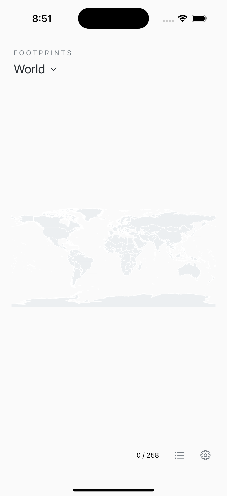
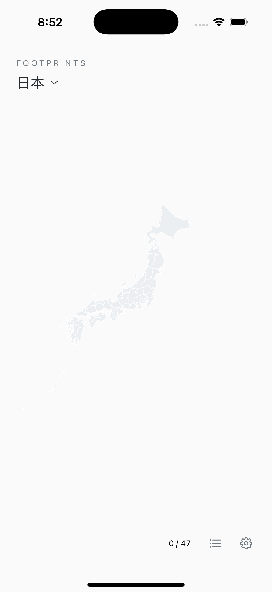

# Global preview validation

Validated source: `6812d1968d4a2dd1afa5970986ebeff090d62424`.
GitHub Actions: [run 37907335498](https://github.com/ZongruiMa/Footprints-Global/actions/runs/37907335498), October 9, 2026.

- Xcode 16.4 / macOS 15: 16 Swift package tests passed.
- iOS Simulator: 30 tests passed, including core tests, worldwide resource
  loading and matching, ten language/permission resources, country aggregation,
  legacy note preservation and reclassification of pending local imports.
- An iPhone arm64 Release build succeeded. This is an unsigned device build,
  not a simulator binary. The archive includes maps and localization resources.
- Host checks: 50 Swift source files parsed, Xcode project references checked,
  34 original region geometries/IDs preserved, valid worldwide polygons,
  representative cities across continents, and all 104 translation keys with
  matching placeholders in all ten languages.
- English world and Japanese country screenshots were reviewed. An initial
  Arabic sheet direction problem was corrected; the final screenshot confirms
  the settings labels, controls and navigation mirror right-to-left.
- Tracked files were scanned for common credential/private-key patterns and
  local identifying paths. This public repository starts from a clean history;
  no prior private repository commits or user device logs were imported.

## Limits of this validation

No new physical-iPhone acceptance run has been performed for this preview.
An earlier reported system photo-authorization prompt failure is not claimed
fixed. Permission timeout behavior and picker file/GPS ingestion have automated
coverage; real device authorization, iCloud downloading, signing and refresh,
large photo libraries, all territory boundaries and native-speaker translation
quality still need real-world review.

The pinned Xcode toolchain emits existing SwiftData predicate macro Sendable
warnings under complete concurrency checking. The project uses Swift 5 language
mode; these must be addressed before enabling Swift 6 language mode. They did
not prevent compilation or tests. No external runtime libraries are used.

## Simulator screenshots

| English world | Japanese regions | Arabic settings |
| --- | --- | --- |
|  |  |  |

These are actual simulator captures with no user photo data.
